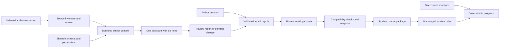

# CourseWeave specification

**Bundle:** `author-edition-0.3.0-review-1` · **Date:** 2026-09-14 · **Status:** Approved; implementation in progress. Required release gates remain open.

This is the shared specification for [Teacher Edition](COURSEWEAVE-TEACHER-EDITION.md) and [Student Edition](COURSEWEAVE-STUDENT-EDITION.md). Read the three together. The [specification index](README.md) records approval, ownership, and consistency checks. New requirements describe the planned release, not work already delivered.

## Purpose and scope

CourseWeave helps an expert turn a practical course into an inspectable study experience. A human author decides what to teach, approves sources and changes, and reviews factual and pedagogical quality. A student reads, predicts, attempts, observes, and checks understanding. Assistants help within the permissions of those activities. The application owns validation, durable mutations, and progress calculations.

One application repository supplies both editions. The existing Author Studio becomes the supported **CourseWeave Author Edition**; “Teacher Edition” in this specification means that same authoring product. It does not mean a second product for classroom administration, grading cohorts, or observing private student activity.

The application release target is **0.3.0**, subject to ordinary release review. Existing application and course v0.2.0 tags, artifacts, and study homes remain intact. The initial export compatibility target is the **released CourseWeave Student v0.2.0, schema version 2**. Candidate Student v0.3.0 also runs the compatibility acceptance cases. Application version, course version, schema version, and author-project format are different values.

## Verified starting point

The published application baseline is `409f5c01e93d98f118967138116b0dbafff80ed7`; the published Agent Harness Path baseline is `c90aa1d84d3b1b1c21a5d263de03c4cb198f55c6`. The inspected local development checkout is `d6a2e590175a55179d2d7e5f007a78a6f91d1800`. Its ancestry is private and is not a publication starting point.

The existing implementation has schema-v2 contracts, deterministic progress/policy, explicit sharing, single-manifest transactions, Author forms, inert preview, proposal review, and validation. The student release has exact-artifact pilot evidence. Existing Author browser tests mainly use intercepted API fixtures; they do not establish a complete installed Author product or real-provider authoring. See [engineering](../engineering.md), [API](../contracts/api.md), and [full-course acceptance](../pilot/full-course-acceptance.md).

## Canonical terms and ownership

| Term | Meaning and owner |
| --- | --- |
| Course package | `courseweave.json` plus explicitly included learner-facing content, runtime inputs, notices, and instructions. |
| Manifest | The sole runtime authority for course/module/phase/surface IDs, learning metadata, completion requirements, and teacher permissions. Parsed by the shared Python contracts. |
| Author project | A private working course copy and an external author-state directory. Source inventory, research snapshots, review decisions, pending changes, and backup receipts belong here. |
| Activity | A manifest phase. Progress labels are `required`, `optional`, or `excluded`. |
| Assistant role | A selected author workflow: curator, curriculum designer, source researcher, fact checker, proofreader, or compatibility reviewer. It grants no mutation authority. |
| Approved source | A specific resource revision the human author accepted for a stated purpose. Approval is a recorded editorial decision, not proof of truth. |
| Check | A native formative single-choice question with authored options and explanatory feedback. |
| Progress | Deterministic satisfaction of recorded requirements. It does not assert learning or mastery. |
| Compatibility report | Deterministic checks of a specific package against a named student profile, with errors, warnings, and checks not performed. |
| Review report | Evidence-linked assistant findings plus separate human dispositions. It cannot award compatibility or mastery. |

The JSON below is the shared machine-readable fact block. Other documents reference these facts rather than defining competing values.

```json
{
  "bundle_id": "author-edition-0.3.0-review-1",
  "application_target": "0.3.0",
  "student_compatibility_target": "0.2.0",
  "course_schema_version": 2,
  "author_project_format": 1,
  "author_roles": ["curator", "curriculum_designer", "source_researcher", "fact_checker", "proofreader", "compatibility_reviewer"],
  "progress_modes": ["required", "optional", "excluded"],
  "teacher_access_modes": ["available", "disabled", "observer_only"],
  "hint_levels": ["none", "gentle", "graduated", "full"],
  "share_kinds": ["selection", "cell", "output"],
  "surface_types": ["html", "markdown", "source", "notebook", "video", "terminal", "external"],
  "check_types": ["single_choice"],
  "conversation_memory": "session_only",
  "mutation_unit": "one_manifest_or_one_authored_file",
  "mastery_gating": false,
  "student_web_retrieval": false,
  "student_managed_knowledge_base": false,
  "author_search_backend": "brave_search_optional_byok"
}
```

## Shared requirements

The requirement table is normative for this approved bundle. `CW` requirements own shared semantics; edition requirements specialize workflows without overriding them. Verification IDs are defined in the [implementation plan](../superpowers/plans/2026-09-14-courseweave-author-edition.md).

| ID | Requirement | Verification |
| --- | --- | --- |
| CW-001 | Both editions MUST consume the same canonical manifest contracts and deterministic policy/progress engines. Client forms and assistants MUST NOT establish alternative runtime rules. | V01, V07 |
| CW-002 | Exports targeting Student v0.2.0 MUST retain schema version 2 and pass the released validator as well as candidate validation. Author-only fields MUST NOT be inserted into that manifest. | V01, V07, V09 |
| CW-003 | Existing course/module/phase/check/objective IDs and notebook cell IDs MUST survive import and unchanged export. Explicit identity edits MUST show their impact; no silent renumbering or migration is allowed. | V02, V03, V07 |
| CW-004 | Author sources, student work, preview work, application runtimes, and evidence MUST use distinct owned local directories. Import and preview MUST create copies; they MUST NOT mutate the source or a student home. | V02, V08, V09 |
| CW-005 | Active work MUST use verified nonsynced storage. Symlinks, path traversal, special files, and redirected destinations MUST fail safely at read/write boundaries. | V02, V03, V09 |
| CW-006 | An assistant response MUST remain advice, a review report, or a pending change. Only an explicit human decision through the authoritative service may apply the shown revision. | V03, V04, V10 |
| CW-007 | Each accepted change MUST target one manifest or one authored file, use an expected content hash/revision, and be atomic and idempotent. A collection of changes MUST NOT be described as one atomic transaction. | V03, V10 |
| CW-008 | A package export MUST use a stable snapshot and explicit file inventory, validate before finalization, record hashes, and never overwrite an existing export. Concurrent source changes MUST invalidate or restart the snapshot visibly. | V07, V09, V10 |
| CW-009 | Effective student assistance MUST be computed from the active phase and valid records before any provider call. Disabled, observer-only, and unmet gates MUST block calls, including greetings. | V01, V08, V09 |
| CW-010 | Student workspace content MUST require explicit permitted sharing. Author permissions MUST NOT extend into any student's files, records, provider credentials, or conversations. | V04, V08, V09 |
| CW-011 | Model availability MUST NOT be required for manual authoring, local validation, reading, native checks, deterministic progress, or export of an otherwise valid course. | V04, V07, V09 |
| CW-012 | Conversation history MUST be session-only. Persisted author reports or proposals MUST be deliberate artifacts with an explicit save action; saving one MUST NOT silently save its entire chat. | V04, V10 |
| CW-013 | Documents, source pages, model output, and imported metadata MUST be treated as untrusted content. Their text MUST NOT alter permissions, network scope, or mutation rules. | V04, V05, V08 |
| CW-014 | Every reported result MUST distinguish deterministic checks, assistant judgment, human review, synthetic-provider evidence, and real-provider evidence. Missing evidence MUST stay visible. | V06, V07, V09 |
| CW-015 | Submission, file presence, an authored correct option, and an assistant's confidence MUST NOT be represented as demonstrated mastery. No chapter mastery gate is added in this release. | V01, V06, V08 |
| CW-016 | Optional protocols/labs/videos MUST remain optional. An unaided protocol MUST not gain assistance through an author feature or preview shortcut, and software MUST NOT fabricate real-world completion. | V07, V08, V09 |
| CW-017 | Learner-facing course files and exports MUST exclude private author research, review drafts, credentials, student state, and chat. Built-in formative answer keys are deliberately included in the manifest; they are not secure exam secrets. | V07, V09 |
| CW-018 | Changes to source content, policy, manifest, or reviewed target MUST invalidate dependent assistant context, pending changes, and reports whose evidence no longer matches. History MUST NOT silently reintroduce revoked material. | V03, V04, V06, V10 |
| CW-019 | Errors MUST retain recoverable drafts and explain the next action without exposing secrets. Interrupted requests MUST not silently resume or claim success; owned child processes and temporary credentials MUST be cleaned up. | V04, V09, V10 |
| CW-020 | The three specifications MUST share one bundle ID, unique requirement ownership, explicit cross-references, and complete requirement-to-verification mapping. A normative change MUST trigger a cross-edition consistency review. | V00, V09 |
| CW-021 | Student-facing promises MUST be limited to capabilities enforced by the targeted student runtime. Author research rules, review rubrics, and prerequisite notes MUST NOT be presented as student-enforced retrieval or mastery controls. | V01, V06, V07 |
| CW-022 | Application and course licensing MUST remain separate. Imports MUST preserve notices; asset inclusion MUST record the author's redistribution decision. The application remains PolyForm Shield; this plan does not relicense the course. | V02, V07, V09 |

## Compatibility and evidence semantics

The compatibility profile supports the existing surface types. The installed acceptance scope is macOS on Apple Silicon, a single local user, local HTML/Markdown and static diagrams, source views, native single-choice checks, optional external resources, and Python notebooks using the existing Jupyter runtime. The demonstrated notebook baseline remains Python 3.11/3.12 with standard-library exercises. Additional dependencies or kernels require separate environment evidence; recognizing their metadata is not installation acceptance.

Four labels remain distinct:

1. **Draft saved:** durable author content exists; references may still be incomplete.
2. **Automatic compatibility checks passed:** exact manifest, assets, links, fragments, selectors, runtime declarations, and supported behavior passed the declared checks.
3. **Student preview checked:** a named package revision was exercised in an isolated actual student runtime; its coverage is recorded.
4. **Author reviewed:** a human disposed of editorial/source findings for that revision. This does not certify the subject or learning outcomes.

An export may be a clearly labeled draft. A standard student handoff requires automatic compatibility to pass and records the remaining preview/editorial scope explicitly. There is no blanket “100% correct” or universal “ready for every environment” badge. Blocking compatibility errors cannot be waived by the assistant or the author; changing the target profile is a new explicit decision, not a hidden downgrade.

## Data and authority flow



Author state is not runtime policy. A source rule in the author project controls author research, not the student's tutor. The current student tutor receives authored learning metadata and explicitly selected lesson text; it does not search the author's source catalogue. Approved source extracts become available to it only when the author deliberately includes them in learner-facing lesson content or supported manifest metadata.

Discovery results are temporary Author session data, not durable evidence. Saved research records retain the author request and application outcome; separately selected direct source fetches have their own retained provenance and review decisions. Search provider terms do not confer publisher redistribution rights. This distinction changes neither schema-v2 nor Student context or state.

## Boundaries and deferred work

Deferred: hosted multi-tenant SaaS, billing, cohorts/gradebooks, student surveillance, a managed vector database or knowledge graph, automatic background source updates, student browsing/RAG, mastery certification, secure/proctored assessment, autonomous notebook/shell execution by the assistant, arbitrary rich document conversion/OCR, multi-user editing, and a ChatGPT integration. Each requires its own scope and acceptance evidence. [Future interfaces](../superpowers/specs/2026-09-14-chatgpt-courseweave-feasibility.md) records the current custom GPT assessment.

The specifications aim to make contradictions detectable through ownership, explicit invariants, traceability, and systematic review. Finite checks cannot prove that no semantic inconsistency exists in prose. They must report what they checked and retain a human review step.
